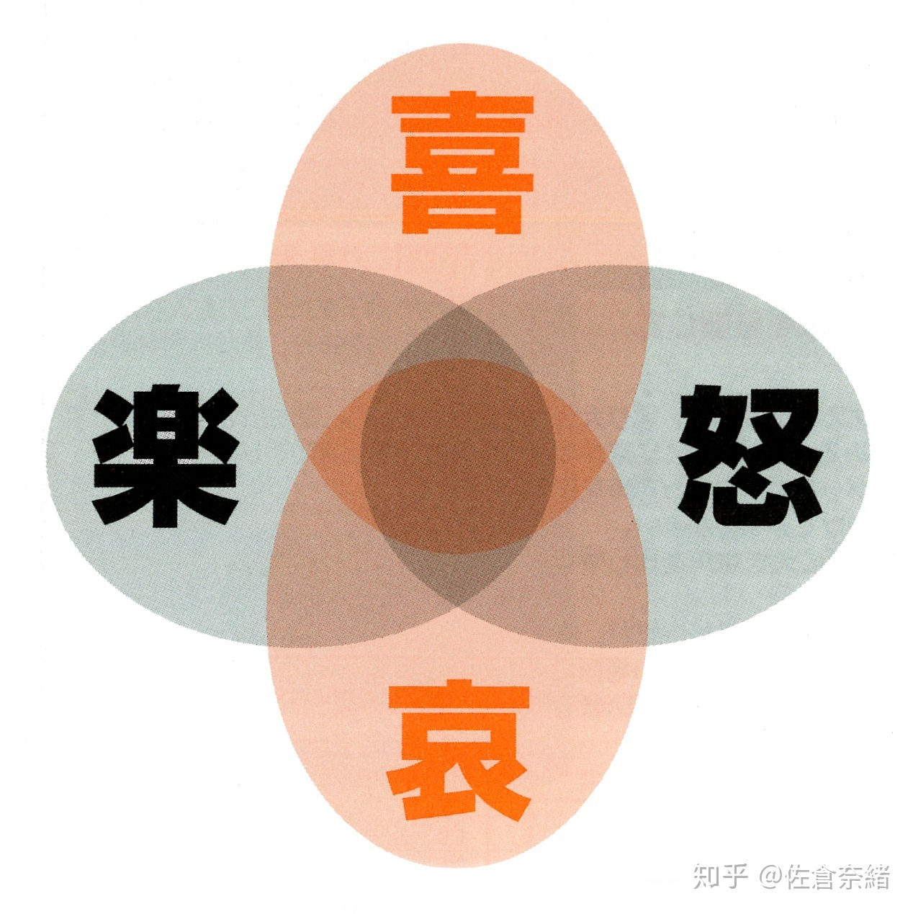

> 本章节摘自：
>
> [ぜったい声優になる! 最強トレーニング BOOK 改訂版](https://www.amazon.co.jp/dp/4862561624)\
> （ISBN: `978-4-8625-6162-6`）\
> （译名：绝对要成为声优！最强练习 BOOK 改订版）
>
> 第三章 家中的练习 基础篇 - Lesson 6 抑扬

（以下的练习请以女声发出）

在我们的日常生活中会相对自然的使用抑扬。当然首先需要理解标准的抑扬，随着确切的活用，能让“喜怒哀乐”的感情有着更加丰富的表现。

重叠上更进一步的练习，混入“哀”和“喜”了的微妙的感情的案例，大人和孩子，男性和女性等，能够对不同的年龄和性别进行演绎。

抑扬大体上分类成 **升调** 和 **降调** 两种。



是你吗（叫住别人的时候）

去吗？（疑问）

什么都做不成啊（以小孩子的声音提升句尾）





走路去（表示意向）

是的（肯定）

什么都做不成啊（以大人的声音下降句尾，表达出安定了的感觉）



## （阶段 1）喜怒哀乐 {#stage-1}



【喜】谢谢（抬高第一个“谢”，较为轻快）

【怒】谢谢（无抑扬，较低沉）

【哀】谢谢（抬高第二个“谢”，像哀求一样，升调）

【乐】谢谢（稍快）





【喜】你好啊（以高音调抬高“啊”，升调）

【怒】你好啊（无抑扬，较低沉）

【哀】你好啊（抑扬较弱，慢慢地）

【乐】你好啊（抑扬较弱，稍快）





【喜】怎么啦（降调“怎么”，升调“啦”）

【怒】怎么啦（“怎”之后开始降调表示出怒气）

【哀】怎么啦（降调最后面的“啦”）

【乐】怎么啦（以高音抬高“怎”和“啦”）





【喜】是这样吗（抬高首尾）

【怒】是这样吗（强烈下沉结尾表示出失望的感觉）

【哀】是这样吗（忽然下沉后半段，缓慢地）

【乐】是这样吗（轻松）





【喜】再见了（元气满满地升调）

【怒】再见了（无抑扬）

【哀】再见了（无抑扬，声音较低）

【乐】再见了（结尾升调，轻松的感觉）



## （阶段 2）演绎大人和孩子的声音 {#stage-2}

说话的时候，孩子的声音会有上提句尾（升调），大人则会下沉句尾（降调）的倾向。
同时，在逗号和句号之间停顿则会变得像大人一样的声音，停顿较短的话则会像孩子一样。
注意这两点，在这里尝试演绎大人和孩子的喜怒哀乐吧。



> 场景：很高兴哦

孩子：很高兴哦（句尾升调）

大人：特别地，高兴（稍停顿，句尾降调）





> 场景：为什么会变成这样啊

孩子：为什么会变成这样啊（句尾升调）

大人：为什么，会变成这样啊（停顿，句尾降调）





> 场景：老师去世了。明天是葬礼

孩子：老师去世了。明天是葬礼（停顿之前升调）

大人：老师，去世了。明天，是葬礼。（标点符号处停顿，句号处降调）





> 场景：忽然心情很好呢

孩子：忽然心情很好呢（句尾升调）

大人：忽然心情很好呢（句尾降调）



## （阶段 3）情景分离 {#stage-3}

这次对情景进行细分，以下面的例子，尝试着以自己的想象力来演绎吧。
同时意识着阶段 2 的句尾升调或降调的变化和标点符号的利用吧。



13 岁的男子初中生在对着朋友（共有快乐的感觉）

30 岁的人朝着同性朋友（鼓励）

50 岁的人朝着女儿（担心）




20 岁的女性朝着男朋友（愤怒）

30 岁的女性朝着丈夫（呆滞）

50 岁的人朝着女儿（教诲一样的感觉）




15 岁的女孩子朝着母亲（隐藏着自己的悲伤）

30 岁的女性朝着男朋友（感动）

70 岁的女性朝着孙辈（满面的幸福感）




14 岁的男孩子向着很久没见的小学时代的朋友（感动）

40 岁的男老师朝着很久之前教过的学生（怀念感）

60 岁的男性朝着年轻的外甥（超过了担心的时期，抱有感慨地）




10 岁的小学男生朝着妈妈（天真的感谢，稍微有点撒娇）

快 20 岁的人向着朋友（纯真的感情）

50 岁的人朝着女儿（强调感谢的心情）

70 岁的人朝着孙子（一边感受着对方的可爱）




10 岁的小学女生朝着祖母（包含着安慰的感觉）

25 岁的男性向着女性朋友（关心）

40 岁的女性朝着在餐馆打工的朋友（一边意识着周围人一边强调着感谢）

60 岁的男性朝着妻子（包含着到现在为止的感谢之情）




10 岁的小学男生向着男性朋友（豪放）

25 岁的女性朝着男朋友（稍微包含着一点担心的感觉）

45 岁的男性朝着学生时代的同学（稍微有点距离感）

70 岁的女性朝着孙子（缓慢且温柔）



---

原文：

- 成为女孩子的声音！【49】抑扬顿挫\
  <https://zhuanlan.zhihu.com/p/50526550>
